# Sphinix Mobile

<p align="center">
  
</p>

<p align="center">
  <strong>A production-style smartphone specification, comparison, technology content, and AI-assisted publishing platform built with Next.js.</strong>
</p>

<p align="center">
  <a href="https://sphinix.xyz" target="_blank">Live Website</a> ·
  <a href="https://github.com/Mike-leonard/sphinix-mobile/tree/main/docs" target="_blank">Technical Documentation</a> ·
  <a href="https://github.com/Mike-leonard/sphinix-mobile/tree/main/docs/s-shot">Screenshots</a>
</p>

---

## About the Project

**Sphinix Mobile** is a modern, responsive web platform for discovering smartphones, exploring detailed specifications, comparing devices, reading technology articles, and managing a content-driven mobile information website from a secure administration dashboard.

The project is built around the **Next.js App Router**, **React Server Components**, **Server Actions**, **PostgreSQL**, and **Prisma ORM**. The public website is designed for fast server-rendered navigation and SEO, while the admin application provides a complete workflow for managing devices, specifications, brands, filters, rating criteria, affiliate markets, blogs, analytics, AI generation, and global site configuration.

A major part of the project is reducing repetitive editorial work. Administrators can generate device specifications and blog content with **multiple AI providers**, generate SEO metadata, scrape source content from URLs through Jina Reader, and maintain reusable technical specification structures rather than hard-coding every device field.

### Project goals

- Make smartphone research easier for users.
- Provide a structured, searchable and comparable device catalog.
- Publish technology content alongside device specifications.
- Give administrators a flexible CMS-like dashboard instead of hard-coded content workflows.
- Automate repetitive content creation with AI while retaining editorial control.
- Support country-specific affiliate markets and localized currencies.
- Keep the application maintainable through modular queries, Server Actions, reusable components, caching, testing, and CI/CD.

---

## What the Project Does — User Perspective

Sphinix Mobile is designed as a consumer-facing smartphone research platform.

### Smartphone discovery

Users can:

- Browse the latest smartphones from multiple manufacturers.
- Search by device name or brand.
- Filter devices using configurable technical attributes such as price, RAM, battery capacity, display type, and operating system.
- Switch between **Grid View** and **List View**.
- Open a dedicated device page with a quick summary, detailed specifications, ratings, and purchase links.

### Device comparison

Users can select devices from the catalog and manage them through a floating comparison drawer. The comparison page presents up to **three devices** side-by-side and highlights differences across specifications such as display, chipset, cameras, battery, and expert ratings.

### Technology blog

The `/blogs` area provides categorized technology articles and technical breakdowns with rich media and formatted content. Comments are configurable from the dashboard.

### Regional shopping links

Device pages can display **country-specific affiliate retailers** and currencies. The application can use Geo-IP information and configured market data to show localized store buttons; a configured global market can act as a fallback when a country has no links.

### User accounts

Authentication includes login, registration, password-reset flows, session protection, Google OAuth callbacks, and Turnstile bot protection. User device reviews/comments are part of the planned roadmap rather than the current core release.

**Live project:** https://sphinix.xyz

---

## Architecture

The application uses a layered Next.js architecture. Most application mutations and server-side data operations use **Server Actions** and a separate **query abstraction layer**, while specialized Route Handlers are reserved for cases such as OAuth callbacks and database-backup downloads.

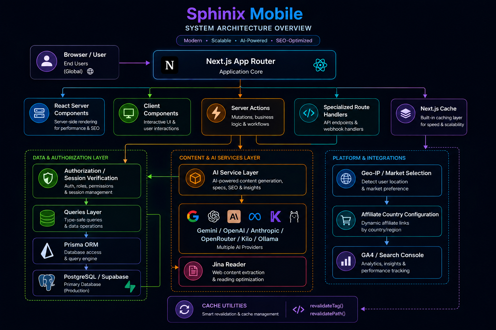

### Application layers

| Layer | Responsibility |
|---|---|
| `app/` | Routes, layouts, Server Components, loading states, error boundaries and pages |
| `components/` | Reusable UI and feature components; complex managers follow an orchestrator pattern |
| `actions/` | Server Actions for authentication, mutations, form processing, cache invalidation and admin workflows |
| `queries/` | Database access, filtering, pagination, aggregation and relational queries |
| `lib/` | Utilities, AI adapters, affiliate helpers, formatting, scraping and shared infrastructure |
| `prisma/` | Prisma schema and database model definitions |
| `context/` | Shared client-side state such as device comparison state |
| `docs/` | Architecture, data model, design, API, Server Action and workflow documentation |

The component documentation also explicitly distinguishes Server Components from Client Components, keeping browser-only state and interaction where it is needed while allowing most rendering to remain server-side.

---

## Data Model & Backend Design

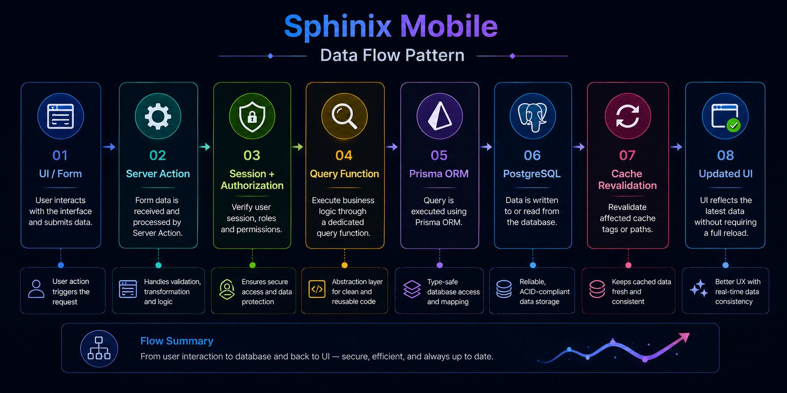

The persistence layer is **PostgreSQL**, accessed through **Prisma ORM**, with the database hosted on **Supabase PostgreSQL**. Global site configuration is stored through a singleton `SiteSettings` record whose JSON/JSONB fields contain SEO, typography, appearance, analytics, advertisement, localization, security, media, maintenance, comments, social, and AI configuration.

The query layer isolates database operations from Server Actions. Device queries cover pagination, counts, search, sorting, multi-attribute filtering, primary-key creation, and deletion; similar query modules exist for brands, attributes, groups, filters, rating bars, affiliate countries, settings, and blog content.


This separation keeps database access out of UI components and makes application logic easier to test and evolve.


---

## User Experience — Screenshots

The public interface follows a mobile-first responsive design, with light/dark themes, reusable Shadcn/Radix UI primitives, premium card styling, glassmorphism-inspired surfaces, and route-specific shimmer loading states designed to reduce perceived layout shift.

### Home page

The home page combines the navigation/search experience, featured-device carousel, latest devices, technology articles, and responsive loading states.

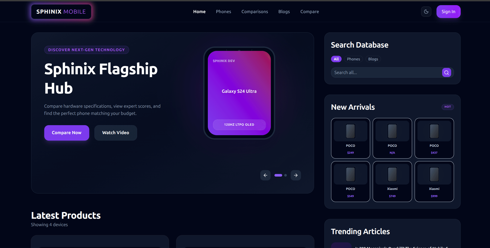
---

### Smartphone catalog — `/phones`

The catalog supports search, brand filtering, configurable technical filters, sorting, and Grid/List views.

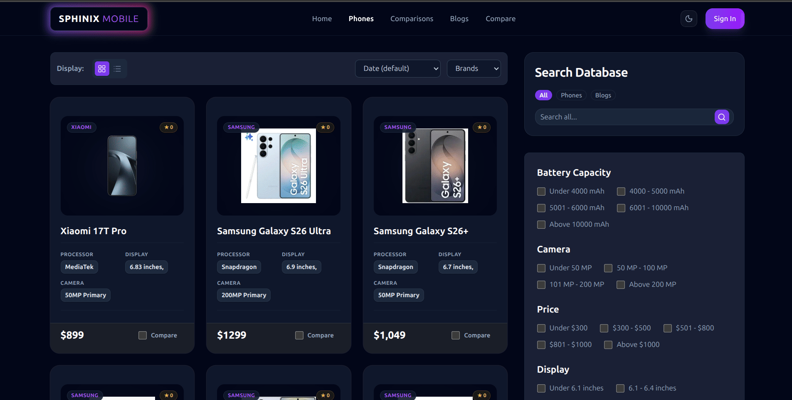

---

### Device comparison — `/comparisons`

Users add devices to a comparison drawer and then open the dedicated comparison page to review the selected devices side-by-side.

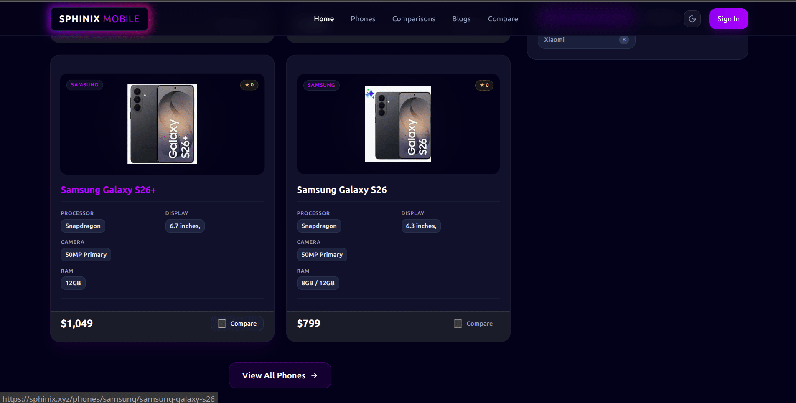

---

### Device details — `/phones/[brandSlug]/[deviceSlug]`

The device page combines quick information, localized purchase links, overview content, grouped specifications, and expert ratings.

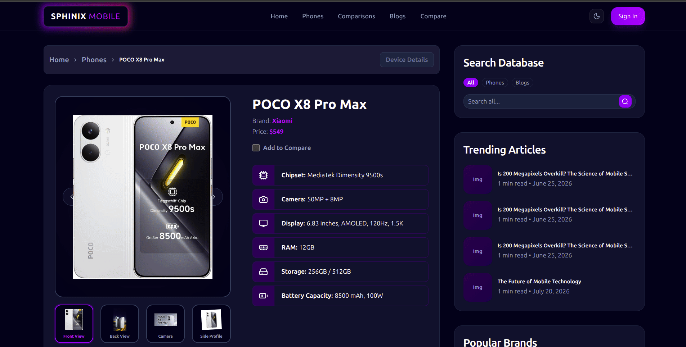

---

### Technology blogs — `/blogs`

The blog area presents published articles with categories and responsive content layouts.

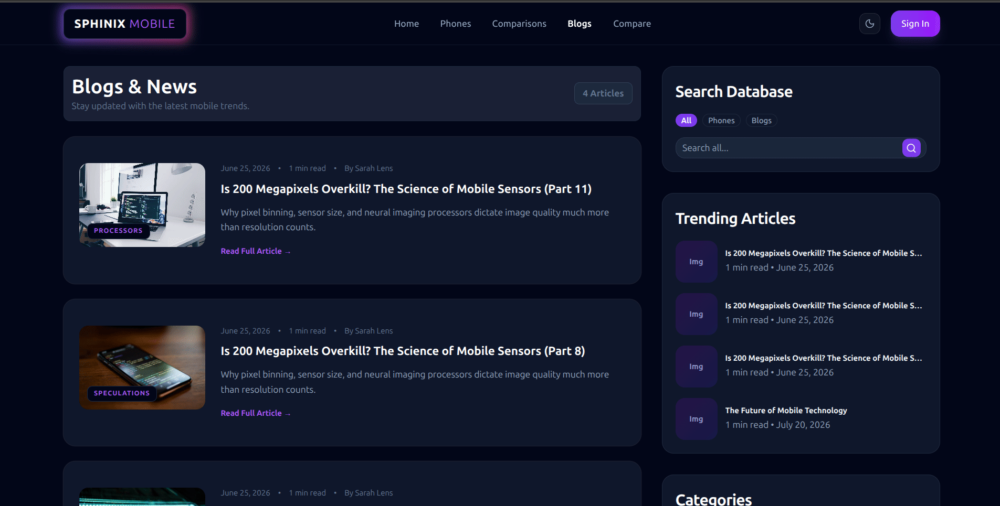

---

### Error recovery — 404

The application includes a custom theme-aware 404 page and route-level error boundaries with retry/recovery actions.


---

## Admin Dashboard — How the Platform Is Controlled

The authenticated dashboard turns the project into a full content and configuration platform. Administrative Server Actions verify the current session before sensitive operations, and status-protection rules prevent published content from being trashed directly.

### `/dashboard`

The dashboard provides:

- Published phone and blog counts.
- Publishing-trend analytics with multiple time ranges.
- Month-over-month trend indicators.
- GA4 and Google Search Console visitor/search insights.
- Interactive analytics by channels, locations, and devices.
- A protected admin error boundary that keeps the dashboard shell available during failures.

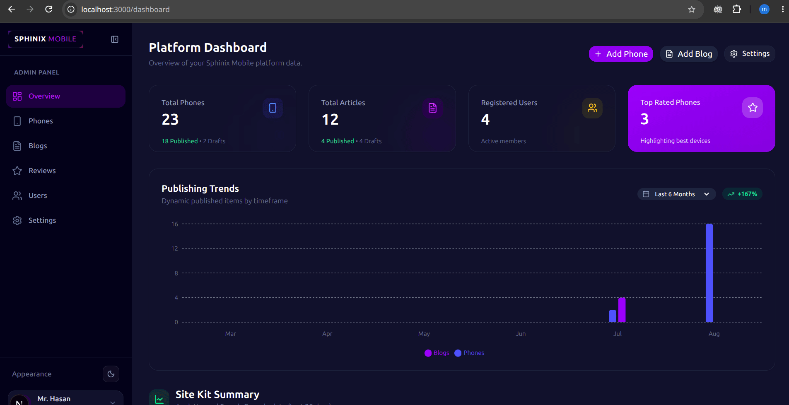

---

### `/dashboard/phones`

The phone manager is the main catalog control center.

**Content management**

- Search, filter and sort device records.
- Switch devices between Draft and Published states.
- View, edit, duplicate, trash and restore devices.
- Protect published devices from direct trash operations.
- Keep generated slugs stable after title edits so existing URLs do not break.

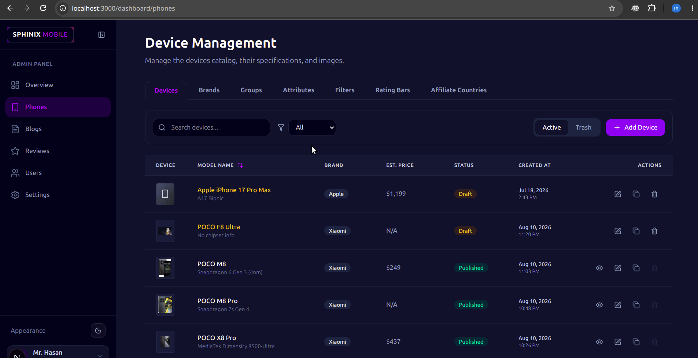


---

## AI Content Creation

AI is treated as an application service rather than being embedded directly into page components.

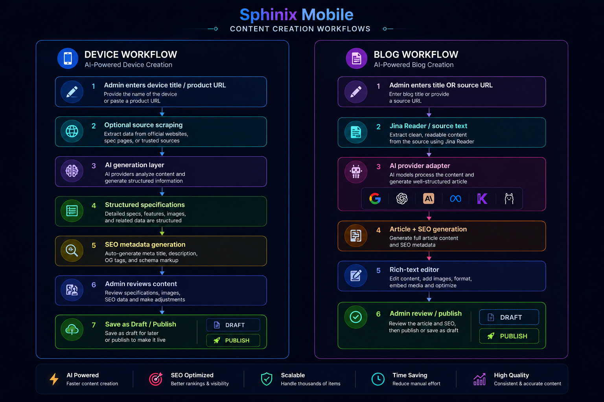

The project uses Jina Reader to obtain clean Markdown from external pages and supports multiple AI providers through a shared generation layer. Generated HTML is sanitized before being rendered.

### `/dashboard/phones/new`


| **AI-assisted Creation**                                                 | **Dynamic Affiliate Links & Store Management**        |
| :----------------------------------------------------------------------- | :---------------------------------------------------- |
| 🤖 Generate specifications from a device name                            | 🌍 Configure store links per target country           |
| 🔗 Generate specifications from a product URL                            | 🛒 Maintain retailer URLs and prices                  |
| 🧩 Populate structured device data through reusable technical attributes | ➕ Add custom retailers                                |
| 🔎 Generate SEO metadata                                                 | 💱 Use localized currency symbols and market defaults |
| ✨ Create overview/content through configured AI workflows                |                                                       |

### `Create a new Device` by [Device Name and Brand Name]
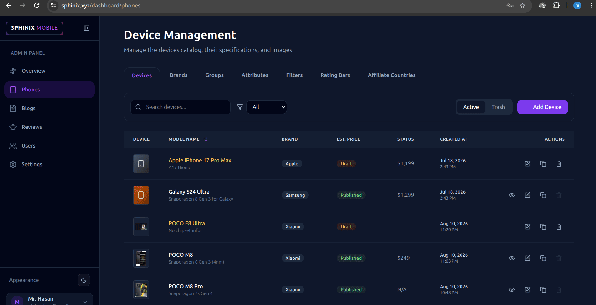

### `Create a new Device` Using Device URL/LINK
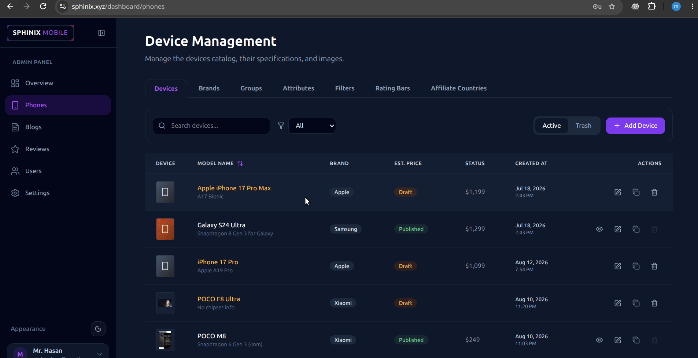

---

### `/dashboard/phones/groups`

Groups organize reusable specification attributes into sections such as **Display**, **Platform**, **Camera**, and **Battery**.

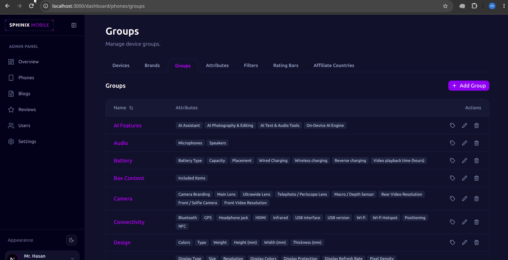

---

### `/dashboard/phones/attributes`

Attributes define technical keys such as `Processor` and `Battery Capacity`. They can be ordered for frontend presentation, and reusable terms can reduce repetitive data entry during new device creation.

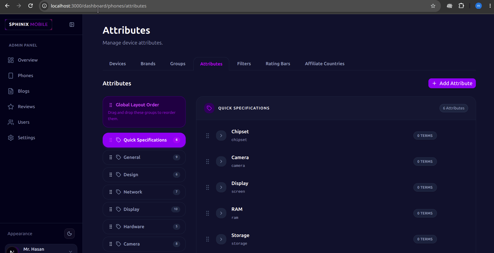

---

### `/dashboard/phones/filters`

Controls which technical attributes appear in the catalog sidebar and allows the filter order to be managed without changing frontend code.

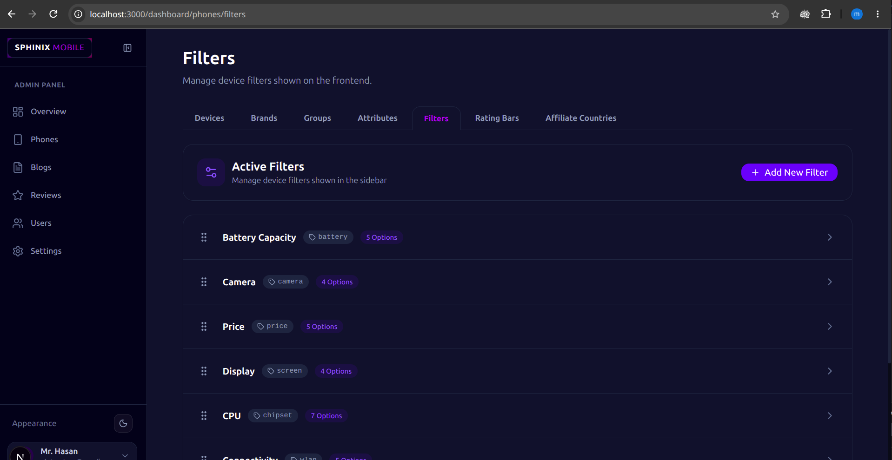

---

### `/dashboard/phones/rating-bars`

Defines the scoring criteria used for expert device ratings, including categories such as design, display, performance, camera, and battery.

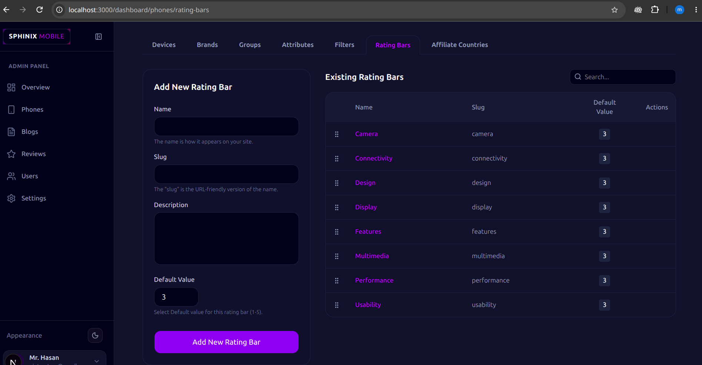

---

### `/dashboard/phones/affiliate-country`

Controls the country marketplace layer:

- ISO country code.
- Flag.
- Currency symbol.
- Active/inactive market state.
- Default retailer templates.
- Global default market.
- Country-specific device store links.

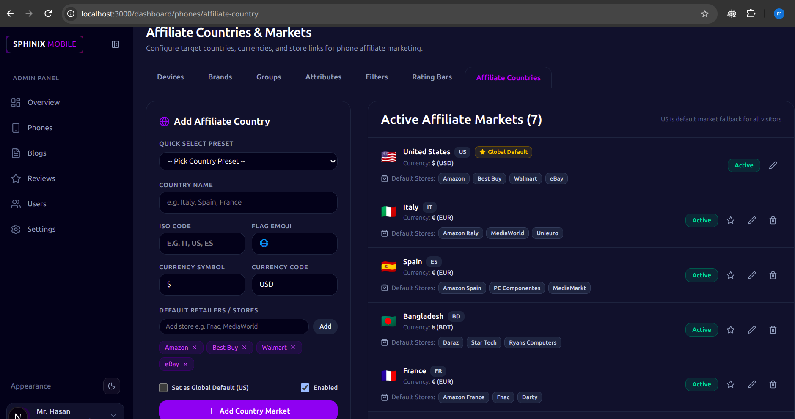

---

### `/dashboard/blogs`

The blog manager supports:

- Search and filtering by Published, Draft and Trash status.
- Draft/published toggling.
- Safe trash rules.
- Article duplication with clean slugs.
- Tiptap-based rich text editing.
- Category management.
- AI-assisted article generation.

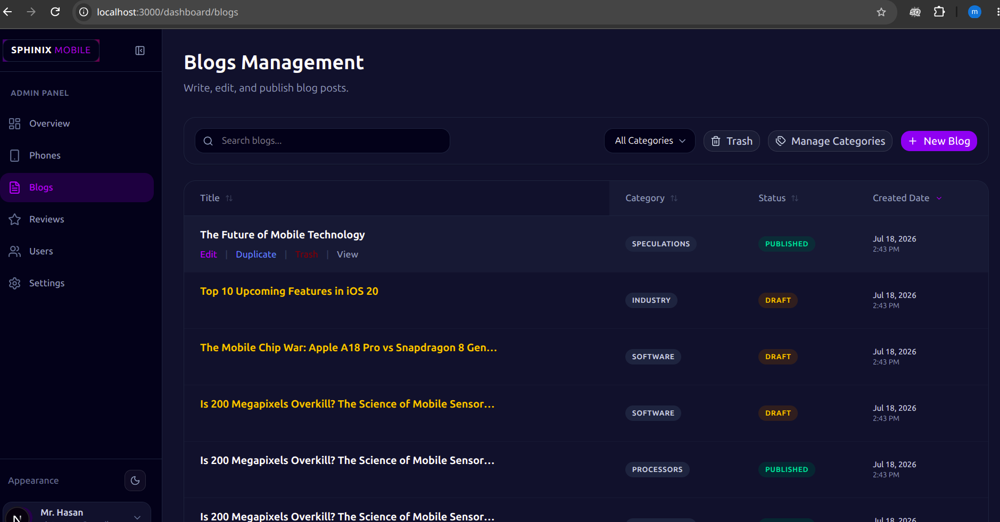

---
## Frontend Settings Controls 


Configure Global settings and visual interfaces of the frontend from here. You can also set a custom maintenance page from here and control other frontend settings. The settings control panel is devided into 8 main sections. Each section is dedicated to a specific type of setting.

### `/dashboard/settings/seo-metadata`

Global SEO controls include:

- Site title and meta description rules.
- Open Graph configuration.
- Structured JSON-LD settings.
- Global SEO defaults.
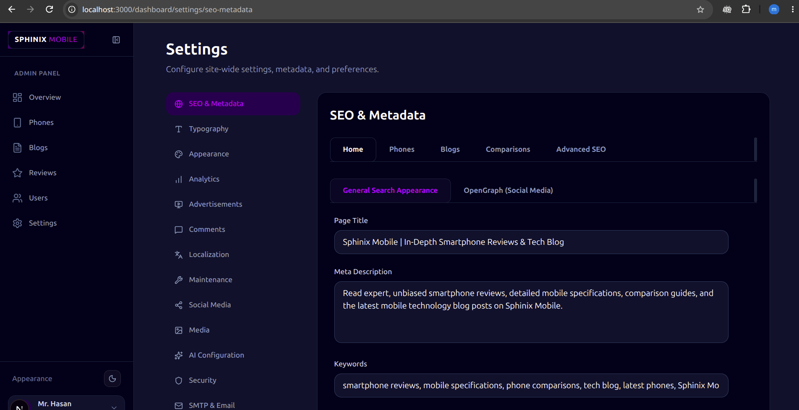

---


### `/dashboard/settings/typography`

Controls dynamic typography values for headings, paragraphs, card titles, and buttons through application settings rather than hard-coded values.

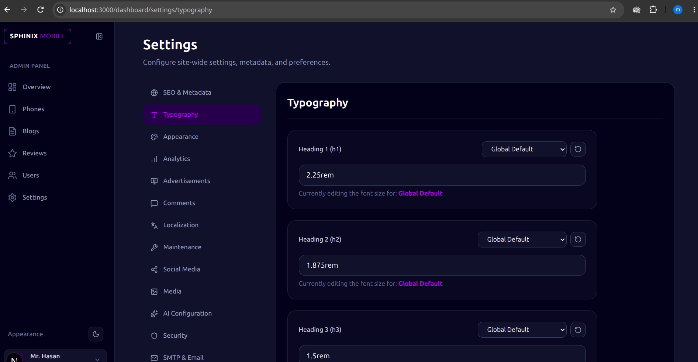

---

### `/dashboard/settings/appearance`

Controls:

- Default theme.
- Brand colors.
- Homepage layout limits.
- Phone/blog pagination limits.
- Device-card specification badge limits.

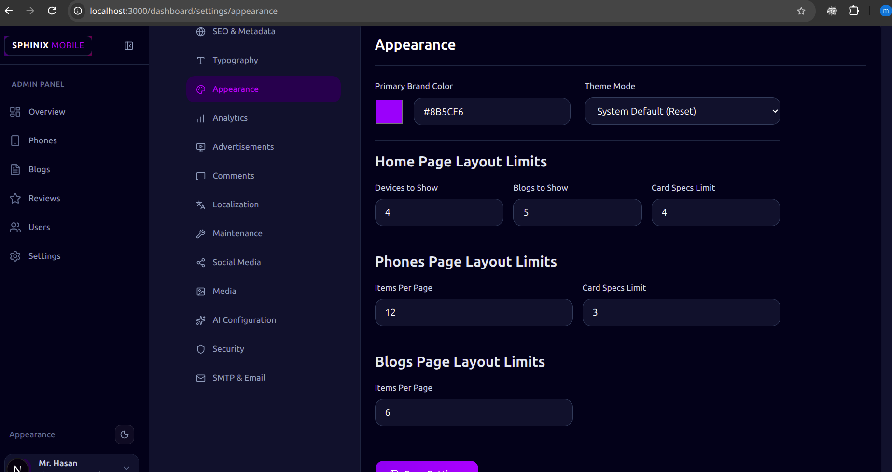

---

### `/dashboard/settings/advertisements`

Controls advertisement configuration such as publisher IDs, placement toggles, and in-feed injection frequency.

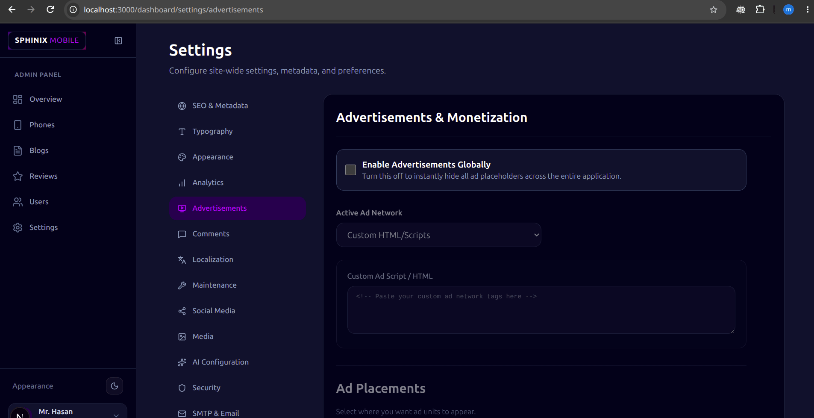

---

### `/dashboard/settings/maintenance`

Controls maintenance mode and the custom offline experience.

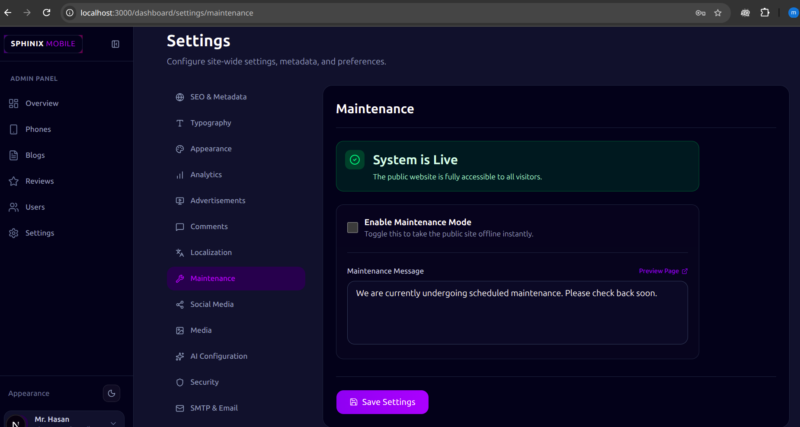

---

### `/dashboard/settings/ai-configuration`

Centralized configuration for:

- Active AI provider.
- Model name.
- API key configuration.
- Feature toggles.
- System prompts/persona rules.

Supported providers include **Gemini, OpenAI, Anthropic, OpenRouter, Kilo, and Ollama**.

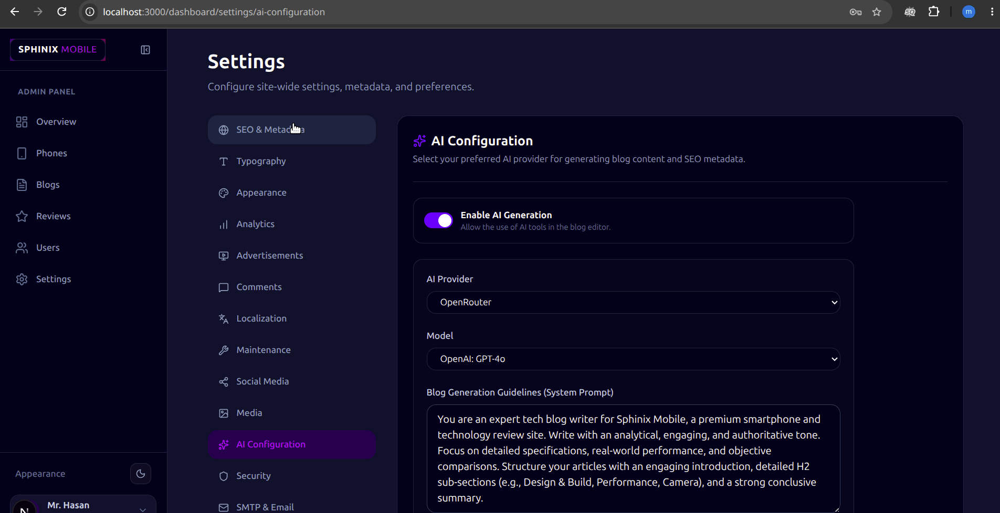

---

### `/dashboard/settings/security`

Controls security-related configuration such as request-rate limits, login attempt limits, and bot-protection settings.

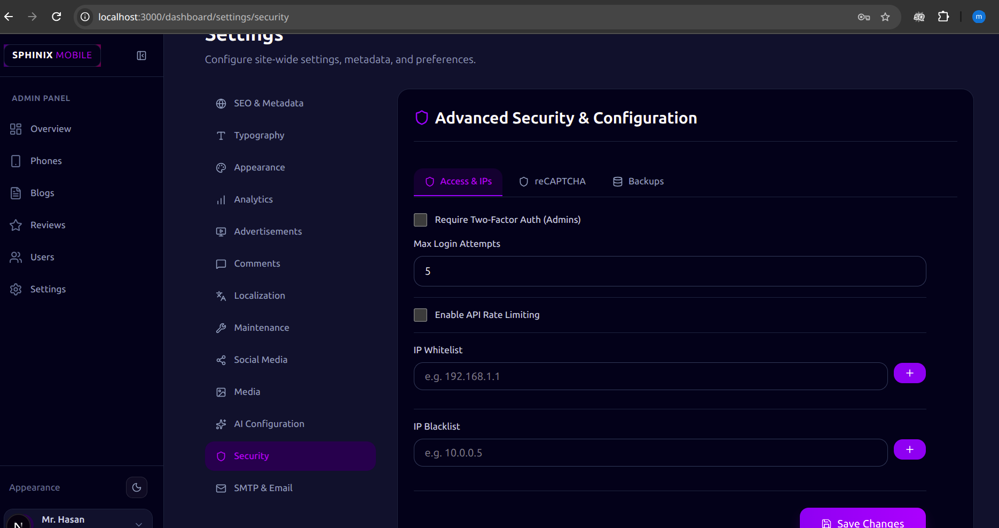

---

### `/dashboard/settings/smtp-email`

Provides SMTP configuration for application email workflows.

### Other configurable areas

The settings model also supports analytics, localization, comments, social links, media/image processing, maintenance, and application-wide configuration through a singleton `SiteSettings` record.

---

## Technical Highlights

| **Next.js Architecture**                                                    | **Authentication & Security**                               |
| :-------------------------------------------------------------------------- | :---------------------------------------------------------- |
| ⚡ App Router                                                                | 🔐 Supabase Auth and custom signed-cookie sessions          |
| 🧩 React Server Components                                                  | 🛡️ Server-side session verification with `verifySession()` |
| 🖥️ Client Components only where interactive browser state is required      | 🔑 Google OAuth callback handling with origin sanitization  |
| 🚀 Server Actions for most mutations and server-side operations             | 🤖 Cloudflare Turnstile on authentication forms             |
| 🔗 Specialized Route Handlers for OAuth callbacks and backup downloads      | ⏱️ Rate-limit configuration                                 |
| ⚡ `unstable_cache`, `revalidateTag`, and `revalidatePath` for cache control | 🗑️ Published-content trash protection                      |
| 💀 Route-specific `loading.js` skeletons                                    | 🧼 HTML sanitization using DOMPurify                        |
| 🚨 Global and dashboard error boundaries                                    |                                                             |
| 🔎 Custom 404 handling                                                      |                                                             |

| **UX & Frontend Engineering**                                                             | **Analytics & SEO**                              |
| :---------------------------------------------------------------------------------------- | :----------------------------------------------- |
| 📱 Responsive mobile-first layout                                                         | 📊 GA4 Data API integration                      |
| 🌓 Light/dark theme with `next-themes`                                                    | 🔎 Google Search Console API integration         |
| 🎨 Shadcn/ui and Radix primitives                                                         | 📈 Publishing-trend analytics                    |
| ✍️ Plus Jakarta Sans typography                                                           | 📝 Dynamic metadata and Open Graph configuration |
| 🧩 Reusable orchestrator-style feature managers                                           | 🧠 Structured JSON-LD settings                   |
| ✨ Shimmer skeletons matched to route layouts                                              | 🤖 SEO metadata generation through AI            |
| ⚠️ Custom dialogs instead of native browser confirmation flows for critical admin actions |                                                  |

---

## Tech Stack

### Core

- **Next.js** — App Router, Server Actions, React Server Components, Turbopack
- **React 19**
- **Node.js**
- **Tailwind CSS v4**
- **shadcn/ui / Radix UI**
- **next-themes**
- **lucide-react**

### Backend & Data

- **PostgreSQL** via Supabase
- **Prisma ORM**
- Next.js caching with `unstable_cache`, `revalidateTag`, and `revalidatePath`

### Integrations

- **GeoIP Lite**
- **Cloudflare Turnstile**
- **Tiptap** rich-text editor
- **Recharts**
- **Google Analytics Data API**
- **Google Search Console API**
- **Jina Reader API**
- **DOMPurify**

### AI

- Google Gemini
- OpenAI
- Anthropic
- OpenRouter
- Kilo
- Ollama

### Testing

- **Vitest**
- **React Testing Library**
- **Playwright** for end-to-end tests

The project documentation maintains a more detailed environment and dependency reference in [`docs/toolstack.md`](docs/toolstack.md).

---

## CI/CD & Deployment

The project is deployed to **cPanel shared hosting** through GitHub Actions rather than relying on a managed Next.js platform.

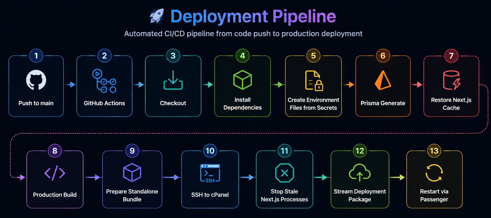

The deployment workflow runs on pushes to `main` and can also be triggered manually. It builds a Next.js standalone package, copies static/public assets and Prisma files, recreates environment files from GitHub Secrets, and deploys to cPanel over SSH using a tar stream.

### Why this setup matters

The project demonstrates deployment beyond a local development environment:

- GitHub Actions automation.
- Production builds outside the hosting server.
- Secret-based environment configuration.
- Prisma client generation during CI.
- Next.js standalone deployment.
- SSH-based deployment to cPanel.
- Server-process cleanup before deployment.
- Passenger restart integration.

---

## Technical Challenges & Engineering Journey

The project evolved through several architectural stages rather than being built as a fixed stack from day one.

### 1. From local data to a production database

The early implementation used local JSON data and file-based read/write workflows. As the application became more dynamic, this approach was replaced by a database-backed architecture and eventually moved toward **PostgreSQL/Supabase + Prisma**.

This transition made it possible to support relational entities such as devices, brands, attributes, specification groups, blogs, users, affiliate countries, and global settings while keeping database operations modular through the query layer.

### 2. Moving from hard-coded specifications to dynamic attributes

A mobile catalog cannot realistically hard-code every specification field forever. The application therefore moved toward reusable attributes and groups that administrators can create, reorder, reuse, and map into catalog filters. This allows new specification types to be introduced without rebuilding the entire frontend.

### 3. AI generation without coupling the UI to one provider

AI requirements expanded from simple text generation to device specifications, blog creation, source scraping, SEO metadata, and configurable prompts. A provider abstraction was introduced so the project can switch among multiple AI backends without rewriting the content-management UI.

### 4. Preventing destructive content operations

Because the dashboard manages published content, simple delete actions are dangerous. Published phones and articles therefore cannot be trashed directly; they must first be returned to Draft. Duplication also creates Draft copies and clean unique slugs.

### 5. Maintaining stable URLs

Device slugs are generated once and intentionally kept stable when titles are edited. This protects existing links and bookmarks from being broken by editorial changes.

### 6. Next.js + Prisma + TypeScript/JavaScript integration issues

During development, the project required repeated adjustments around Next.js server/client boundaries, Prisma generation, data typing, caching, production builds, and deployment-specific behavior. The resulting documentation separates Server Actions, queries, utility modules, component types, and model logic so these concerns remain easier to reason about.

### 7. CI/CD on cPanel

Deploying a modern Next.js application to cPanel introduced different constraints than deploying to Vercel-style managed infrastructure. The final workflow had to account for standalone output, Prisma externalization, symlink handling, environment reconstruction, SSH authentication, stale Node processes, remote directory cleanup, and Passenger restarts.

### Engineering lesson

The project gradually moved from **making the feature work** toward **making the feature maintainable**: reusable models, modular queries, secure Server Actions, reusable components, centralized configuration, caching, automated testing, and automated deployment.

---

## Testing

The repository includes both unit/component testing and browser-level end-to-end testing.

```bash
# Unit tests
npm run test

# End-to-end tests
npm run test:e2e
```

Vitest and React Testing Library are used for unit/component coverage, while Playwright covers end-to-end flows.

---

## Getting Started

### 1. Install dependencies

```bash
npm install
```

### 2. Configure environment variables

Create the required environment files for your local environment. The production deployment workflow reconstructs these values from GitHub Secrets.

At minimum, the project requires configuration for the PostgreSQL database and the integrations enabled in your environment. See the existing toolstack and application documentation before running production workflows.

### 3. Generate Prisma Client

```bash
npx prisma generate
```

### 4. Start the development server

```bash
npm run dev
```

Open `http://localhost:3000`.

### 5. Run tests

```bash
npm run test
npm run test:e2e
```

---

## Project Structure

```text
sphinix-mobile/
├── .github/
│   └── workflows/          # CI/CD deployment workflows
├── app/                    # Next.js App Router
│   ├── (auth)/             # Login, register, reset password
│   ├── (main)/             # Public website
│   ├── dashboard/          # Admin application
│   ├── api/                # Specialized Route Handlers
│   ├── error.js            # Public error boundary
│   ├── not-found.js        # Custom 404
│   └── sitemap.js          # SEO sitemap
├── actions/                # Server Actions
├── components/             # Reusable UI and feature components
├── context/                # Shared client state
├── docs/                   # Technical documentation + screenshots
├── e2e/                    # Playwright tests
├── lib/                    # Utilities, AI, affiliate helpers, scrapers
├── prisma/                 # Prisma schema
├── queries/                # Database query abstraction
├── public/                 # Static assets
├── __tests__/              # Unit/component tests
└── provider/               # Application providers
```

The repository also includes dedicated configuration, scripts, testing setup, and deployment assets.

---

## Roadmap

Some features are intentionally documented as future work rather than being represented as completed features.

## 🚀 Future Roadmap

| **Planned Product Features**                  | **Planned AI Improvements**                               |
| :-------------------------------------------- | :-------------------------------------------------------- |
| 👤 User device reviews and ratings            | 📱 Batch device creation from multiple phone names        |
| 💬 User comments on device pages              | ⚡ Parallel AI processing with automatic draft creation    |
| 💬 Blog comments and nested replies           | 📊 Live AI generation progress monitoring                 |
| ☑️ Dashboard bulk selection and batch actions | 🤖 AI-generated comparison summaries for multiple devices |

---

## Documentation

The project includes dedicated documentation for the major engineering areas:

| Document | Purpose |
|---|---|
| [`application-flows.md`](docs/application-flows.md) | Public and admin user workflows |
| [`design.md`](docs/design.md) | Visual system, UX patterns and layout architecture |
| [`model_logic.md`](docs/model_logic.md) | Prisma models, JSON configuration and relations |
| [`api_logic.md`](docs/api_logic.md) | Route Handlers and external integrations |
| [`server_actions.md`](docs/server_actions.md) | Server Action design and security |
| [`query_logic.md`](docs/query_logic.md) | Query abstraction, caching and data fetching |
| [`lib_functions.md`](docs/lib_functions.md) | Shared helpers and utility modules |
| [`components-type.md`](docs/components-type.md) | Server/Client component hierarchy |
| [`next-features.md`](docs/next-features.md) | Completed work and future roadmap |
| [`toolstack.md`](docs/toolstack.md) | Frameworks, libraries and environment |

---

## Engineering Behind Sphinix Mobile

Sphinix Mobile intentionally combines several real-world application concerns in one product:

- Public SEO-focused content delivery.
- Dynamic relational data modeling.
- Configurable CMS workflows.
- Authentication and authorization.
- AI-assisted content generation.
- External web-source ingestion.
- Geo-targeted affiliate markets.
- Analytics APIs.
- Caching and invalidation.
- Responsive and accessible UI patterns.
- Unit and E2E testing.
- Automated deployment to a non-managed Next.js hosting environment.

The result is a project designed to demonstrate **product thinking, frontend engineering, backend architecture, automation, and production deployment**, not just a collection of pages.

---
