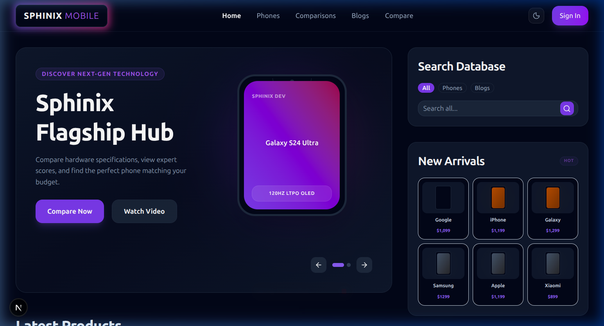
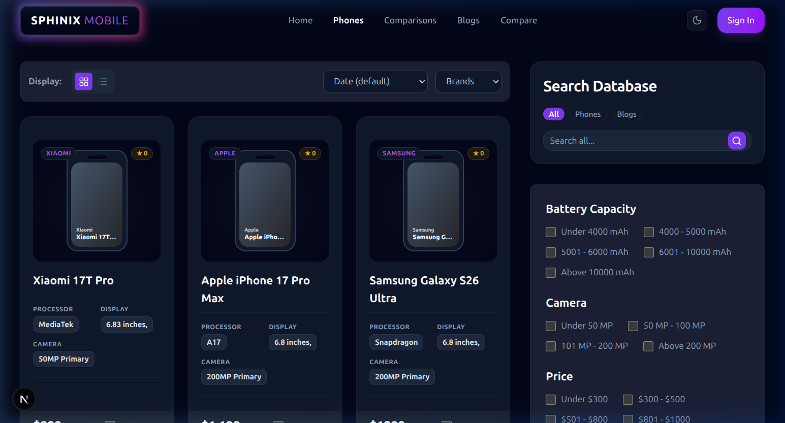
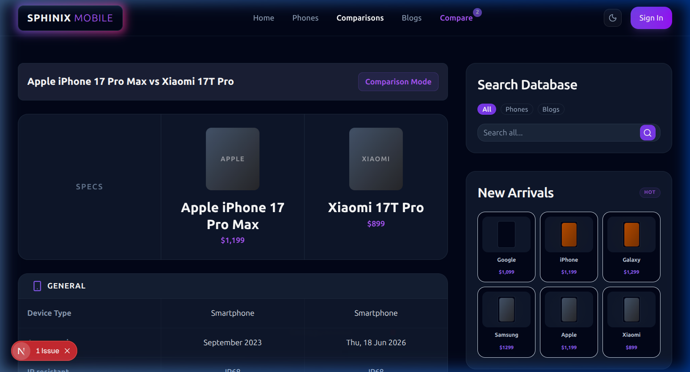
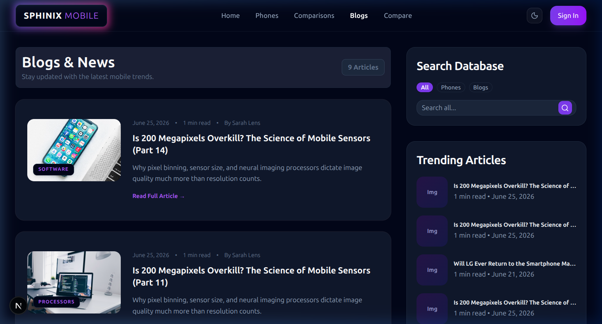
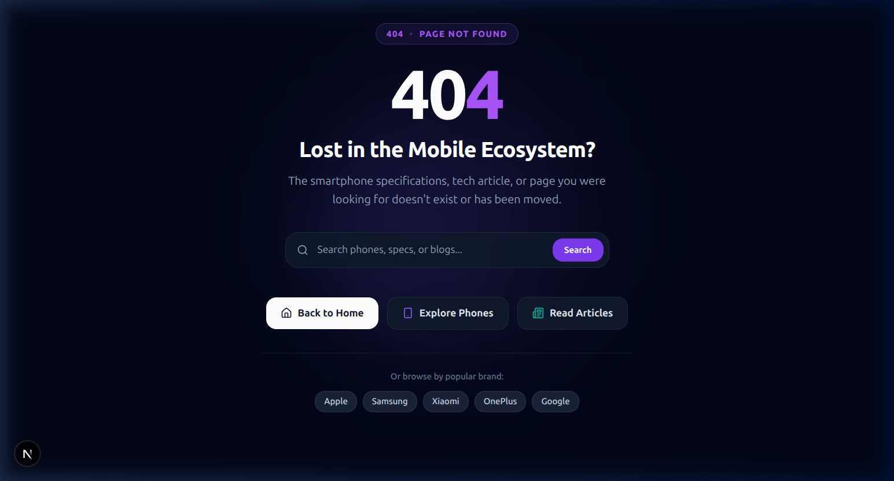

# Application User Guide & User Flows

Welcome to **Sphinix Mobile**, an advanced smartphone catalog, tech review platform, and content management system built with Next.js, React Server Components, Tailwind CSS, and PostgreSQL via Prisma ORM.

This document provides a comprehensive guide detailing all **Public Visitor User Flows** and **Administrator Dashboard Workflows**, complete with visual interface screenshots.

---

## 📋 Table of Contents
1. [Public Visitor Guide](#1-public-visitor-guide)
   - [1.1 Homepage Navigation & Instant Shimmer Skeleton](#11-homepage-navigation--instant-shimmer-skeleton)
   - [1.2 Smartphone Catalog & View Mode Toggles](#12-smartphone-catalog--view-mode-toggles)
   - [1.3 Side-by-Side Device Comparison Tool](#13-side-by-side-device-comparison-tool)
   - [1.4 Device Specification Details & Geo-Targeted Buy Links](#14-device-specification-details--geo-targeted-buy-links)
   - [1.5 Tech Blog & Articles](#15-tech-blog--articles)
   - [1.6 Theme Customization (Light / Dark Mode)](#16-theme-customization-light--dark-mode)
   - [1.7 Error Handling, 404 Not Found & Fail-Safe Recovery](#17-error-handling-404-not-found--fail-safe-recovery)
   - [1.8 Cookie Consent & Privacy Compliance](#18-cookie-consent--privacy-compliance)
2. [Administrator Dashboard Guide](#2-administrator-dashboard-guide)
   - [2.1 Authentication & Dynamic Analytics & Publishing Trends](#21-authentication--dynamic-analytics--publishing-trends)
   - [2.2 Smartphone Management, Export/Import, R2 Media & Validation](#22-smartphone-management-exportimport-r2-media--validation)
   - [2.3 Dynamic Attributes, Groups, Brands, Filters & Affiliate Countries](#23-dynamic-attributes-groups-brands-filters--affiliate-countries)
   - [2.4 Tech Articles, Status Toggling & Article Duplication](#24-tech-articles-status-toggling--article-duplication)
   - [2.5 AI Assistant Workflows](#25-ai-assistant-workflows)
   - [2.6 Global Site Settings Configuration](#26-global-site-settings-configuration)

---

## 1. Public Visitor Guide

### 1.1 Homepage Navigation & Instant Shimmer Skeleton
- **Header Bar:** Contains quick links to `/phones`, `/blogs`, `/comparisons`, global search input, light/dark theme toggle, and authentication options.
- **Instant Shimmer Skeleton (`app/(main)/loading.js`):** Displays a 1-to-1 matching loading skeleton (hero carousel shimmer, 4 product card shimmers, 5 blog card shimmers, right sidebar shimmers) the moment a user clicks any home link.
- **Hero Carousel:** Showcases featured smartphones with direct specification teasers, high-contrast theme-aware cards, and direct navigation links (optimized with responsive font scaling and non-overlapping mobile layouts).
- **Latest Products Grid:** Displays recent smartphone additions with spec badges (governed dynamically by Dashboard Appearance settings) and unified neutral gradients.
- **Latest News & Tech Articles:** Features trending blog posts with category tags and reading time estimates.

*Figure 1.1a: Homepage Desktop Interface*

---

### 1.2 Smartphone Catalog & View Mode Toggles (`/phones`)
- **Global Search:** Type any smartphone name or brand into the search input to dynamically filter items.
- **Brand Selection:** Filter smartphones by brand (Apple, Samsung, Xiaomi, OnePlus, Google, etc.).
- **Sidebar Specification Filters:** Filter products by custom technical attributes (Price ranges, RAM, Battery capacity, Display type, OS).
- **Sorting & Dynamic View Mode Skeletons:** Toggle between Grid View and List View formats. The route skeleton (`app/(main)/phones/loading.js`) automatically reads the user's saved `viewMode` cookie to render the matching Grid vs List shimmer skeleton.
- **Image Fallback Optimization:** Grid and list cards intelligently extract first valid images from database records via `getFirstImageUrl()`.

*Figure 1.2: Smartphones Catalog Page*

---

### 1.3 Side-by-Side Device Comparison Tool (`/comparisons`)
1. **Adding Devices to Compare:** Click the **"Compare"** button on any smartphone card.
2. **Compare Drawer:** An interactive bottom drawer opens, displaying selected devices.
3. **Compare Execution:** Click **"Compare Now"** to open `/comparisons` for a detailed side-by-side spec evaluation.
4. **Highlights & Differences:** Displays side-by-side comparison tables highlighting spec advantages (screen size, chipset, camera megapixels, battery mAh, expert rating scores).

*Figure 1.3: Side-by-Side Smartphone Comparison Matrix*

---

### 1.4 Device Specification Details & Geo-Targeted Buy Links (`/phones/[brandSlug]/[deviceSlug]`)
- **Quick Info Header:** Device launch image, price, key specs, and buy links.
- **Clean QuickSpecs Layout:** Key specs rendered via `DeviceSpecBlock.jsx` with aligned vertical tags (`items-start`), preventing awkward line wrapping.
- **Geo-IP Targeted Buy Links:** Automatically detects the visitor's country (e.g. 🇮🇹 Italy, 🇺🇸 US, 🇪🇸 Spain, 🇧🇩 Bangladesh) via Vercel/Cloudflare headers and client IP lookups:
  - Renders country-specific store affiliate buttons (e.g. MediaWorld, Fnac, Daraz, Amazon) with localized currency symbols (`$`, `€`, `৳`, `CA$`, `£`, `₹`, `A$`, `R$`, `¥`).
  - Falls back to US global default store links if visitor country links are unconfigured.
- **Interactive Tabs:**
  - **Overview:** Engaging HTML summary of the device with modern typography.
  - **Detailed Specs:** Grouped specs (Display, Platform, Camera, Battery, Connectivity).
  - **Expert Ratings:** Ratings breakdown across Design, Display, Performance, Camera, and Battery.

---

### 1.5 Tech Blog & Articles (`/blogs`)
- Browse published articles categorized by topic.
- Deep technical breakdown articles with rich media, formatted code snippets, and structured Article Schema.org JSON-LD.
- Interactive comments section (if enabled in settings).

*Figure 1.5: Tech Blogs & Articles Feed*

---

### 1.6 Theme Customization (Light / Dark Mode)
- Click the **Sun / Moon** icon in the navbar to switch themes.
- Light mode offers clean background surfaces (`#ffffff` / `#f8fafc`) with deep contrast text and neutral card backgrounds.
- Dark mode utilizes deep navy surfaces (`#090d16` / `#0f172a`) with high-contrast text (`text-slate-900 dark:text-white`).
- Both HeroCarousel and ProductCards adapt fluidly across light and dark modes without color bleeding.

---

### 1.7 Error Handling, 404 Not Found & Fail-Safe Recovery
- **Custom 404 Not Found Page (`app/not-found.js`):** Renders automatically on unmapped URLs or when `notFound()` is called. Features a glowing brand 404 tag, inline search bar, navigation buttons (Home, Explore Phones, Read Articles), and popular brand filter pills.
- **Global Error Boundary (`app/error.js`):** Catches unhandled route exceptions while preserving the site Navbar and Footer intact. Includes a **"Try Again"** button to retry rendering without full page reloads.

*Figure 1.7: Theme-Aware Custom 404 Not Found Page*

---

### 1.8 Cookie Consent & Privacy Compliance
- **Consent Banner (`components/CookieConsent.jsx`):** Renders a sleek floating cookie consent banner for visitors.
- **Analytics Gating (`components/AnalyticsWrapper.jsx`):** Automatically delays loading Google Analytics and tracking scripts until the visitor grants consent, meeting GDPR and privacy regulations.

---

## 2. Administrator Dashboard Guide

Access the admin suite at `/dashboard` (authentication required).

### 2.1 Authentication & Dynamic Analytics & Publishing Trends
- **Login:** Sign in at `/login` with administrative credentials or Google OAuth. Redirects are sanitized to enforce `NEXT_PUBLIC_BASE_URL` (`https://sphinix.xyz`).
- **Dynamic Publishing Trends Chart (`PublishTrendsChart.jsx`):**
  - Displays dynamic publication counts for phones and blogs derived directly from item `createdAt` timestamps in PostgreSQL.
  - **Timeframe Selector:** Toggle views between **Last 6 Months** (default), **Last 12 Months**, **This Year**, and **By Year** (multi-year comparison).
  - **Dynamic MoM Trend Badge:** Calculates period-over-period percentage growth (`+X%` / `-X%`).
- **Interactive Visitors Analytics Widget:** View live 28-day active users, page views, search clicks, and impressions synced via GA4 Data API & Google Search Console. Click interactive sub-tabs (**Channels**, **Locations**, **Devices**) to switch pie chart distributions dynamically.
- **Dashboard Error Boundary (`app/dashboard/error.js`):** Protects admin pages from unexpected errors while preserving the admin sidebar navigation.

*Figure 2.1: Administrator Dashboard & Analytics Control Panel*

---

### 2.2 Smartphone Management, Export/Import, R2 Media & Validation (`/dashboard/phones`)
- **Viewing Catalog:** Search, filter, sort by date/time, and manage products.
- **Interactive Status Badge Toggling:** Click table status badges to toggle items directly between `Published` and `Draft`.
- **Status Protection Rule:** Trashing published phones is disabled (`opacity-50 cursor-not-allowed`) to prevent accidental deletion. Devices must be set to `Draft` before moving to Trash.
- **Device Duplication (`duplicateDevice`):** Click the **Duplicate** icon button to clone any device into a new `Draft` state titled `"[Original Title] (Copy)"` with an auto-generated unique slug.
- **Permanent Slug on Edit:** The unique slug/ID generated on creation or duplication remains permanent even if you edit the device title later.
- **Export Device JSON:** One-click download of `<device-slug>-specs.json` containing the entire device configuration (basic info, quick specs, detailed spec groups, gallery images, image alts, affiliate links, expert ratings, and SEO tags).
- **Import Device JSON:** Upload any device JSON file to auto-populate all editor fields immediately. Features unsaved-changes confirmation prompt and schema normalization (supports Sphinx JSON as well as AI/scraper formats).
- **Cloudflare R2 Media Importer (`R2MediaImporterModal`):** Direct server-side upload of high-resolution device images to Cloudflare R2 bucket storage. Allows browsing bucket images, drag & drop uploads, and one-click angle assignment (Front View, Back View, Camera, Side Profile) with suggested SEO alt texts.
- **Spec Finder Modal (`SpecFinderModal`):** Live web search query tool for single attributes that scrapes real-time ground truth from the web, eliminating AI hallucinations.
- **Cross-Validation & Accuracy Auditor (`DeviceSpecValidatorModal`):** Automated tool that cross-checks current device specs against web search data (via Jina Reader/Search), flagging discrepancies and letting admins apply validated specs with one click.
- **Clean Neutral Theme:** Removed legacy `imageColor` / gradient theme picker in favor of clean, consistent neutral gradients across all devices.

---

### 2.3 Dynamic Attributes, Groups, Brands, Filters & Affiliate Countries
- **Attributes (`/dashboard/phones/attributes`):** Define dynamic technical specification keys (e.g. `Processor`, `Battery Capacity`). ContentWriters can add attributes and terms; Admins can edit, reorder, or delete.
- **Groups (`/dashboard/phones/groups`):** Organize attributes into logical sections (`Display`, `Platform`, `Camera`, `Battery`).
- **Brands (`/dashboard/phones/brands`):** Manage manufacturer listings and logos.
- **Filters (`/dashboard/phones/filters`):** Configure which attributes appear in the `/phones` page sidebar filter widget. Drag-and-drop to reorder.
- **Rating Bars (`/dashboard/phones/rating-bars`):** Define custom scoring criteria for device expert ratings.
- **Affiliate Countries (`/dashboard/phones/affiliate-country`):** Configure target country markets, currency symbols, flag emojis, and default retailer templates. Toggle active status and set global default market.

---

### 2.4 Tech Articles, Status Toggling & Article Duplication (`/dashboard/blogs`)
- **Articles Manager:** View all posts with formatted date and time (`Jun 21, 2026` + `2:43 PM`), filter by status (**Published**, **Draft**, **Trash**).
- **Interactive Status Badge Toggling:** Click status badges directly in the table row to toggle between `Published` and `Draft`.
- **Status Protection Guard:** Trashing published articles is disabled to prevent accidental post loss. Articles must be set to `Draft` state prior to trashing.
- **Article Duplication (`duplicateBlog`):** Click **Duplicate** in the action bar to clone any article into a `Draft` copy titled `"[Original Title] (Copy)"` with a clean unique slug.
- **Creating an Article (`/dashboard/blogs/new`):** Use Tiptap WYSIWYG editor or **"Generate with AI"**.
- **Category Manager (`/dashboard/blogs/categories`):** Add, rename, or delete categories with safe relational updates.

---

### 2.5 AI Assistant Workflows
- **AI Provider Support:** Choose between **Gemini**, **OpenAI**, **Anthropic**, **OpenRouter**, **Kilo**, or **Ollama** (local AI).
- **Auto SEO Metadata:** Click **"Generate SEO with AI"** in blog or phone editors to automatically craft meta titles, descriptions, and keywords.
- **System Prompts:** Customize default writing persona and guidelines in **Dashboard → Settings → AI Configuration**.
- **Live Search Spec Verification:** AI spec extraction is paired with `SpecFinderModal` and `DeviceSpecValidatorModal` to cross-validate specs against web ground truth.

---

### 2.6 Global Site Settings Configuration (`/dashboard/settings`)
All administrative settings are saved directly to PostgreSQL (`SiteSettings` model) with instant Next.js `unstable_cache` revalidation (`revalidateTag('site-settings')`):

1. **SEO & Metadata (`/dashboard/settings/seo-metadata`):** Configure global titles, meta descriptions, OpenGraph social images, and structured JSON-LD schemas with dynamic `| Sphinix Mobile` title suffixing.
2. **Typography (`/dashboard/settings/typography`):** Customize dynamic font sizes for H1-H3 headings, card titles, paragraphs, and buttons.
3. **Appearance (`/dashboard/settings/appearance`):** Set default theme mode, primary brand colors, and **Layout Limits** (items per page for `/phones` and `/blogs`, card spec badge count).
4. **Analytics (`/dashboard/settings/analytics`):** Set GA4 Property ID, Search Console site URL, and toggle visitor tracking.
5. **Advertisements (`/dashboard/settings/advertisements`):** Configure Google AdSense publisher IDs, ad placement toggles, and in-feed ad injection frequency.
6. **AI Configuration (`/dashboard/settings/ai-configuration`):** Select active AI provider, model names, API keys, and custom prompts.
7. **Security, Maintenance, Media & Localization:** Manage rate limits, maintenance mode toggles, image optimization, language/timezone defaults, and backup exports.
8. **Decoupled Social Media:** Direct Pinterest auto-publishing was removed in favor of a planned external Social Media Publisher microservice that handles cross-platform broadcasting via API references.
